# March7thHoney-Public

[Simplified Chinese](../README.md) | [English](README_EN.md) | [Traditional Chinese](README_CHT.md)

> A spring-breeze whisper from March 7th, somehow scratching both your ears and your soul.

## Screenshots

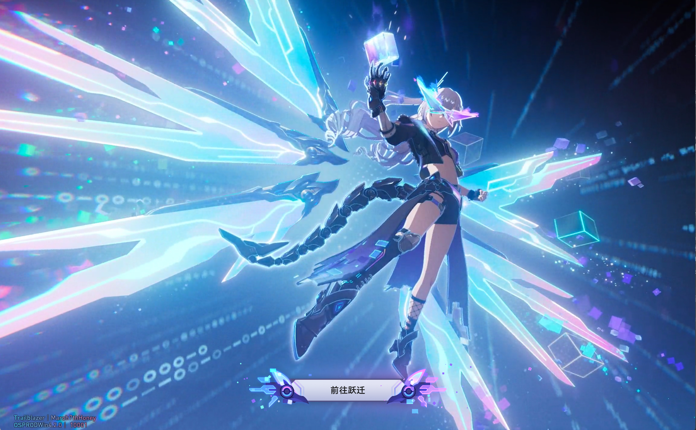
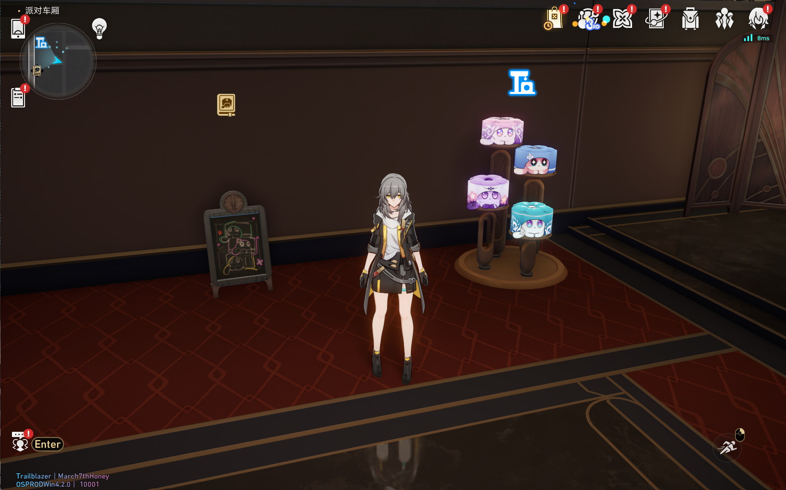
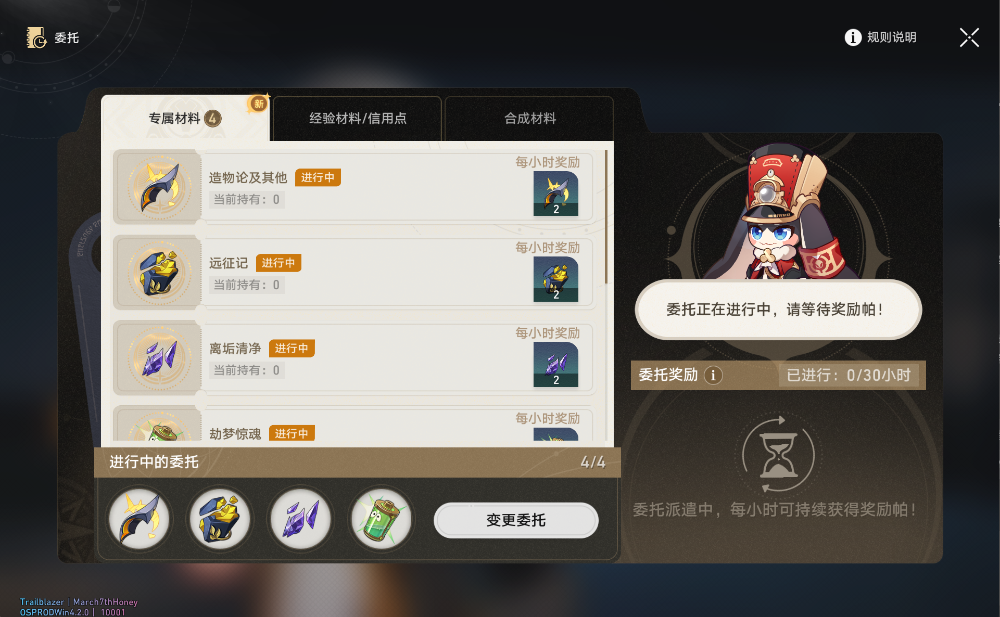
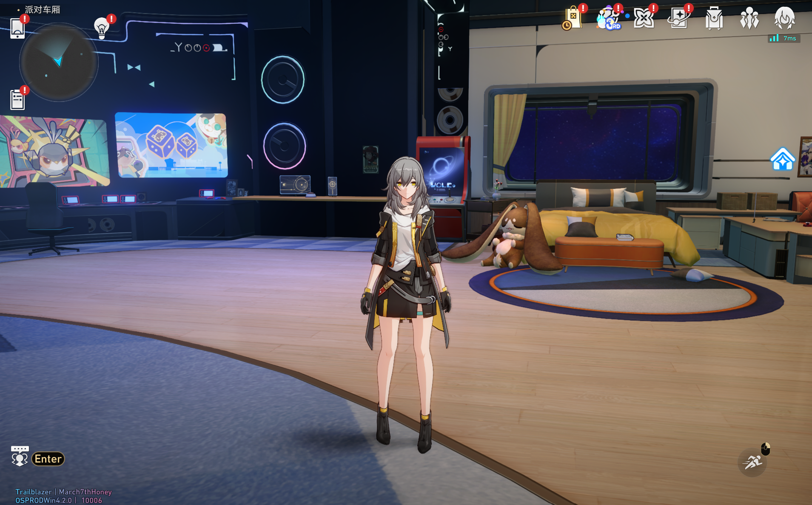
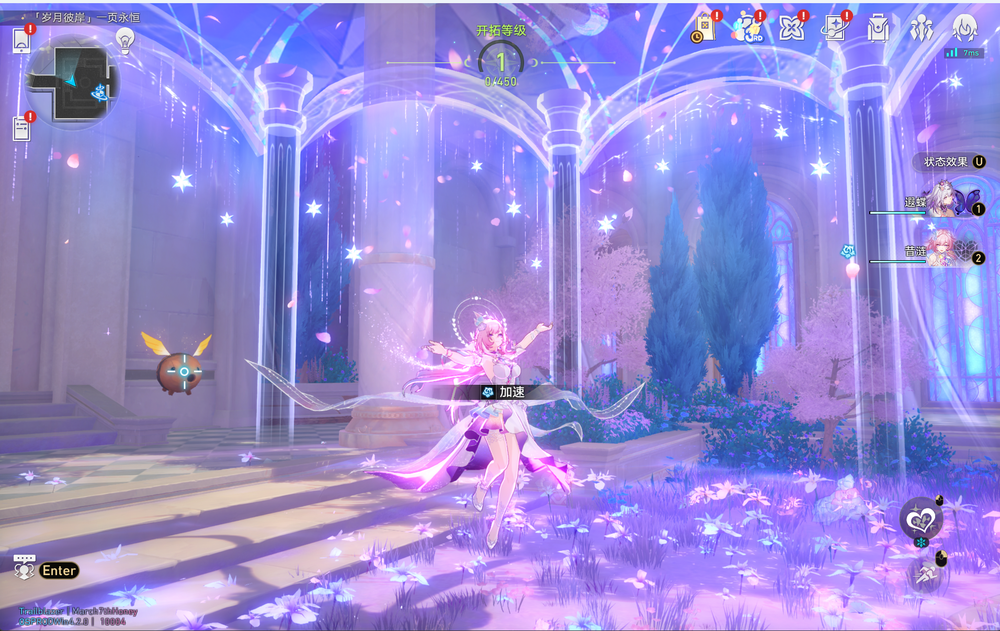
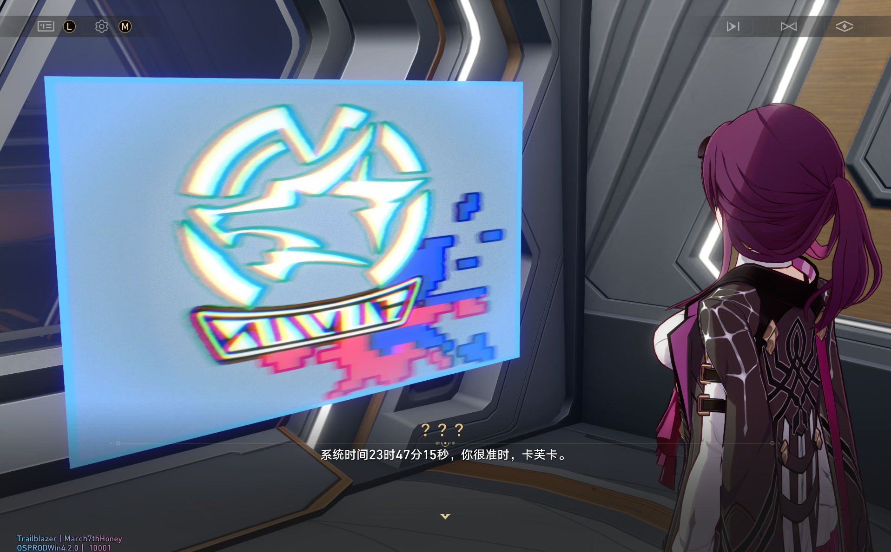
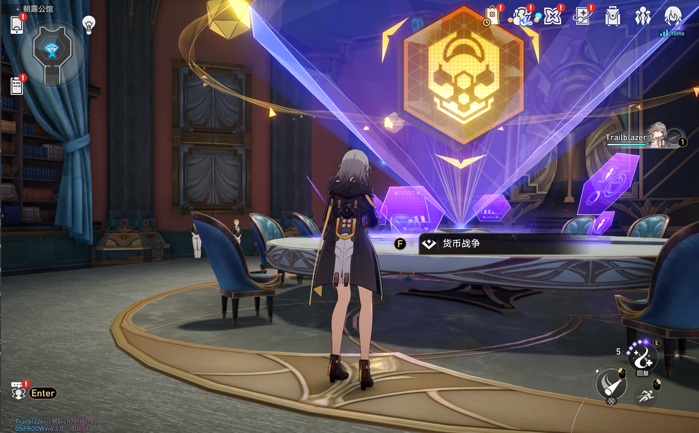
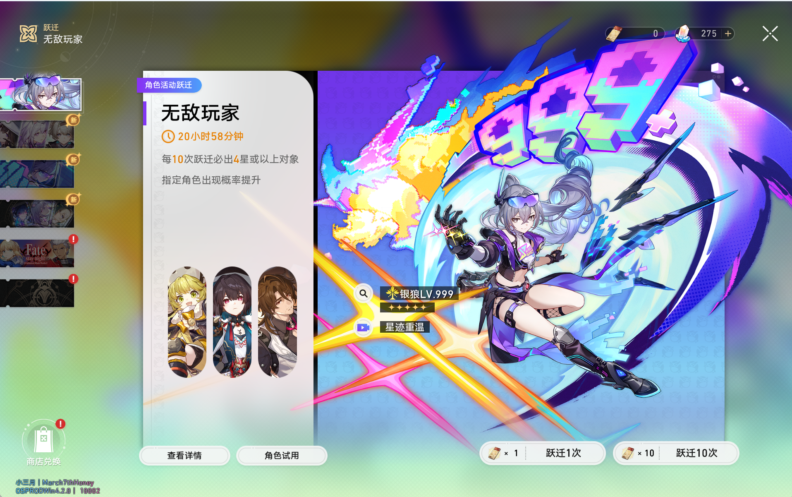
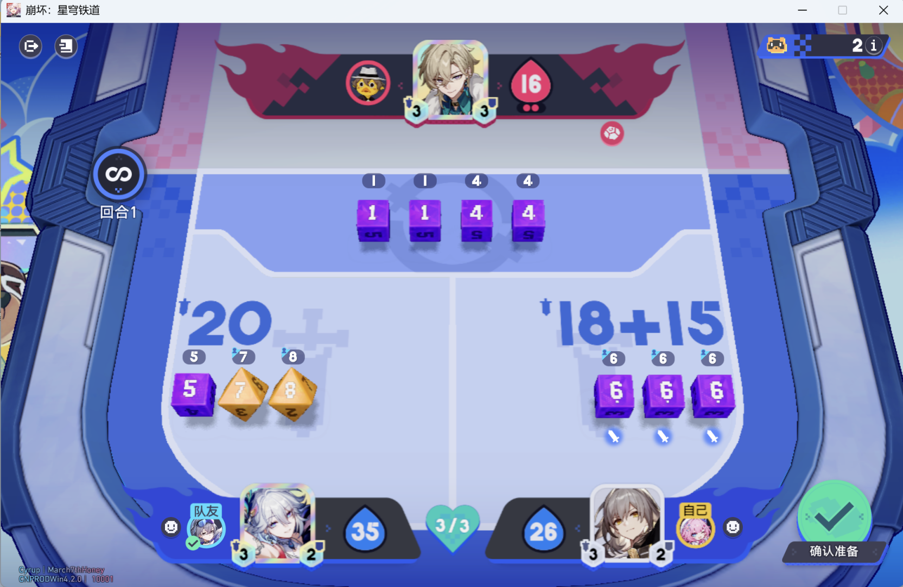
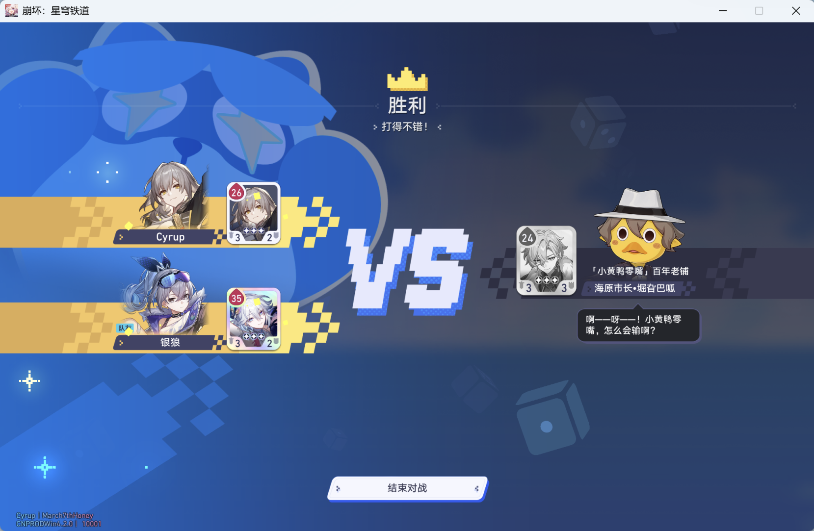
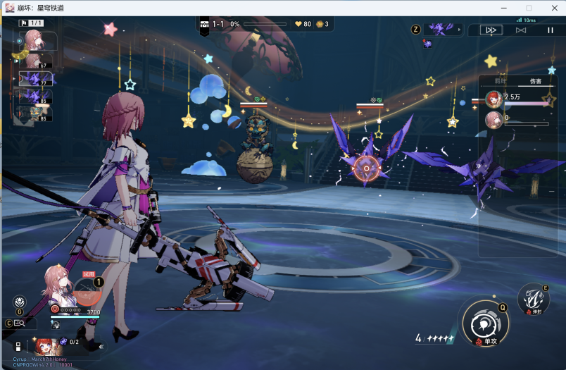

## Overview
This is a game server project aiming for one word: **perfection**.

## Features

1. Shop system: browse and purchase flow works.
2. Team formation: lineup, slot switching, and team changes are complete.
3. Warp/Gacha: full pull flow and result display are supported.
4. Battle flow: you can enter battle and complete the core combat loop.
5. Open-world scene: scene loading, interaction, and basic exploration are available.
6. Character progression: leveling and promotion core loops are available.
7. Quest system: main and common quest progression are supported.
8. Friend system: core friend interaction and display are available.
9. Challenge modes: Forgotten Hall / Pure Fiction / Apocalyptic Shadow are playable.
10. Simulated Universe family: multiple universe-style gameplay branches are supported.
11. Achievement system: most achievements can be tracked and completed.

## TODO

1. Improve Currency War & Divergent Universe.
2. Fill remaining quests and special trigger logic.
3. Continue improving settlement and sync stability in some modes.
4. Expand event-mode gameplay coverage.
5. Keep fixing known minor UI/state-sync issues.
6. Add more configurable options.
